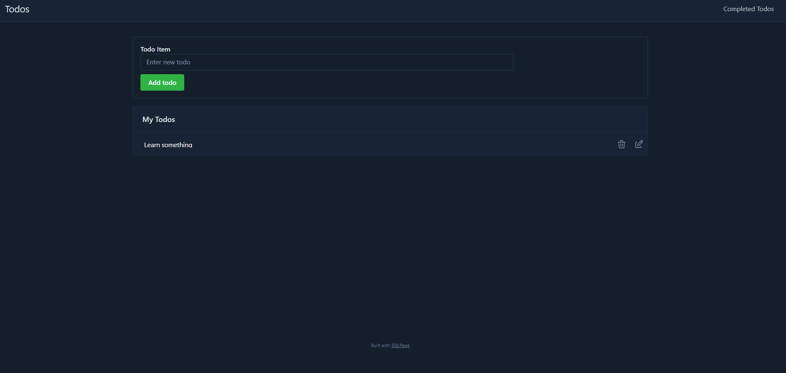
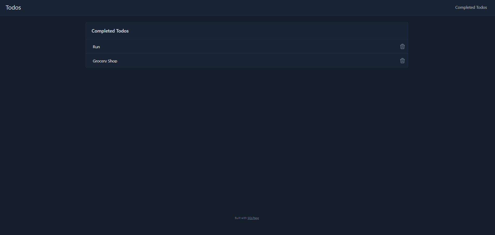

# To-Do App (SQLPage)

## Description

This is a simple to-do application built using SQLPage. It allows users to manage their tasks with full CRUD (Create, Read, Update, Delete) functionality. The app provides an intuitive interface for adding new tasks, updating existing ones, marking them as complete, and deleting them when no longer needed.

## Demo

Check out the live demo here: [Demo Link](https://www.loom.com/share/ce909141beca409e9d62c973a7ee7ae0)

## Screenshots

---

## Features

- Add new tasks
- Edit existing tasks
- Mark tasks as completed
- Delete tasks

## Tech Stack

- **SQLPage** – Used for building the web application with SQL-driven UI.
- **SQLite** – Built0in database for storing tasks.
